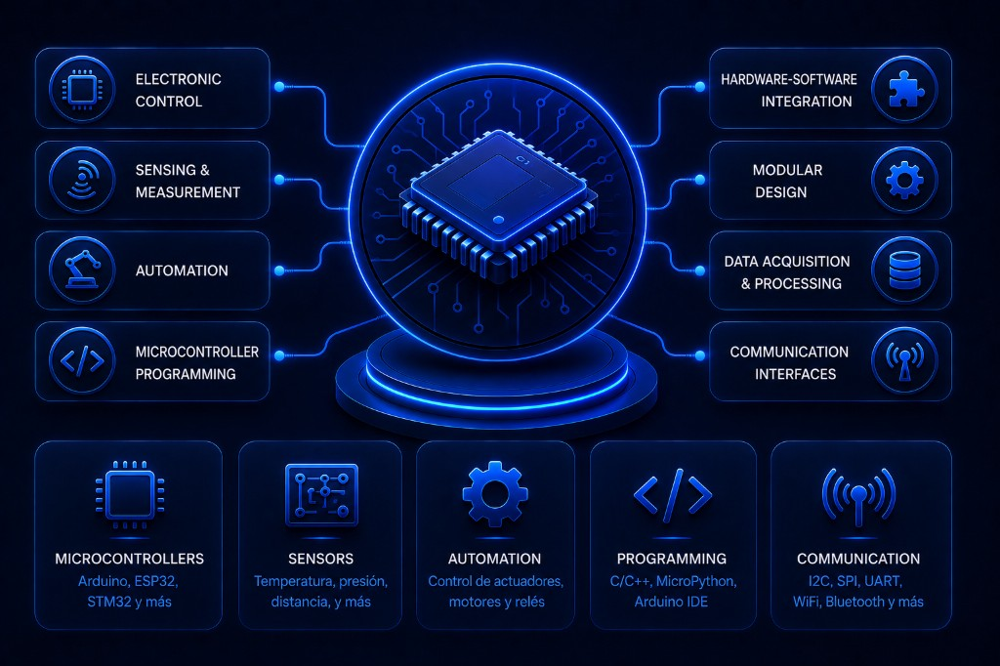
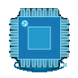
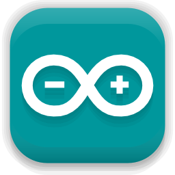
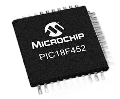
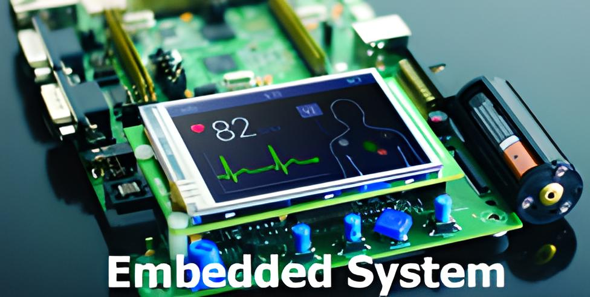
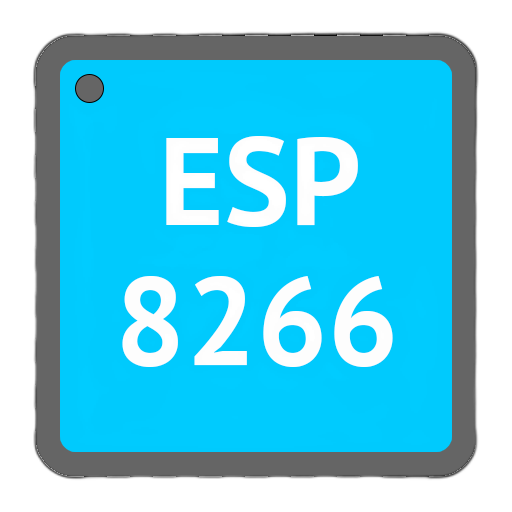

 

  
  

##  Embedded Systems

 

This repository brings together embedded systems projects focused on electronic control, sensing, automation, and microcontroller programming, with practical implementations and modular hardware-software integration.

 

* Languages: C/C++, MicroPython, others.
* Platforms: Arduino, ESP8266, PIC, others.
* Technologies: Electronics, sensors, actuators, communication protocols.
* Tools: MPLAB/PIC compiler, Thonny, Fritzing, Git, VS Code, others.

 
 

<!------Start Index----->

## Index 📜

 
 See 

  

#### 🗂️ Projects

* [State Machine with EEPROM and Multiplexing ](#state-machine-with-eeprom-and-multiplexing)

  
      

* [Automatic Plant Irrigation System ](#automatic-plant-irrigation-system)

  
      

* [Water Level Control with Arduino Mega ](#water-level-control-with-arduino-mega)

  
      

* [Temperature/Humidity Sensing with ESP8266 + DHT11 ](#temperaturehumidity-sensing-with-esp8266--dht11)

  
      

 

<!------Stop Index----->

 
 

## 🗂️ Projects

 

<!------START state-machine------>

### State Machine with EEPROM and Multiplexing 

      

 

### Details

<!-- -->

<!------END state-machine------->

 
 
 
 

<!------START irrigation------>

### Automatic Plant Irrigation System 

      

 

### Details

<!-- -->

<!------END irrigation------->

 
 
 
 

<!------START water-level------>

### Water Level Control with Arduino Mega 

      

 

### Details

<!------END water-level------->

 
 
 
 

<!------START sensing------>

### Temperature/Humidity Sensing with ESP8266 + DHT11 

      

 

### Details

<!------END sensing------->

